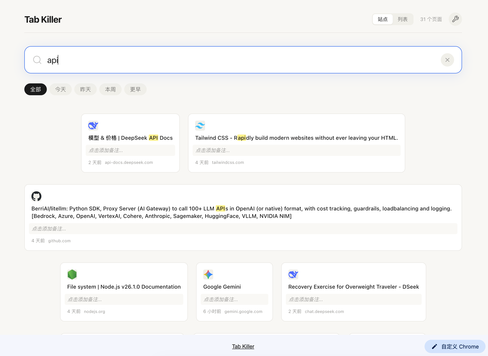

[中文](README.md) · [English](README.en.md)

# Tab Killer 🪓

> 标签页不碍眼、不碍事、也不会丢。

标签页越开越多，浏览器越来越慢，这是所有"多标签党"的日常。**Tab Killer 在后台自动冻结闲置标签页，把内存还给你。**

"那个页面明明打开过，怎么就是找不到？"——只要记得个大概，搜一下就能回来。

不用手动清理，不用分类整理。装好就完事。

## ✨ 它能做什么

| | |
|---|---|
| 🔄 **自动冻结** | 闲置标签页自动 discard，内存回收，点击即恢复 |
| 📦 **自动归档** | 继续不活跃则保存信息后关闭，时间阈值自由调节 |
| 🔍 **自然语言搜索** | 中文分词 + 关键词高亮 + 时间衰减排序，像聊天一样找回页面 |
| 🗂 **域名自动分组** | `api.x.com` 和 `chat.x.com` 自动归到一个站点卡片，宽度自适应 |
| 🎯 **重复检测** | 重复 URL 每 10 分钟自动关闭，保留最近活跃的那个 |
| 📝 **随手备注** | Sidebar 给当前页面写目的，新标签页双向同步，不丢失上下文 |
| 🌙 **暗色模式** | 自动跟随系统，暖色调 Anthropic 风格 |
| 🔒 **数据不出本地** | 全部数据存 Chrome Storage Local，零上传 |

## 📸 界面一览

**Hover 展开**——鼠标悬停 tile，弹簧放大 1.28x，弹出该域名下所有页面：

**列表视图**——一键切换多列卡片网格，按时间筛选：

**关键词搜索**——输入零散记忆，分词匹配 + 高亮 + 时间衰减排序，秒定位已关闭的页面：

**设置面板**——点击齿轮图标，自定义超时时间，修改后立即生效：

## ⚡ 安装

1. 克隆仓库或下载源码
2. Chrome 打开 `chrome://extensions/`
3. 右上角开启「开发者模式」
4. 「加载已解压的扩展程序」→ 选择项目目录

## 🔒 权限说明

这个扩展需要哪些权限？为什么？

| 权限 | 用途 |
|------|------|
| `tabs` | 读取标签页状态，判断哪些闲置了 |
| `storage` | 归档数据 + 配置存本地 |
| `alarms` | 定时扫描不活跃标签页 |
| `sidePanel` | 点击工具栏图标打开侧边栏 |

所有数据仅存于你的电脑，不上传任何服务器。

## ❓ 常见问题

标签页被归档后去哪了？

打开新标签页（⌘T），所有归档以卡片形式展示。搜索关键词或点卡片即可恢复打开。

怎么调整冻结 / 归档的时间？

新标签页右上角 ⚙ 齿轮图标 → 设置面板 → 输入分钟数，即刻生效。

会不会把我正在用的标签页关掉？

不会。当前活动的标签页始终被跳过，不会被自动关闭。

不想某个页面被归档怎么办？

在 Sidebar 给该页面写个备注，或把它钉在 Chrome 里——有音频播放、正在画中画的标签页也不会被归档。

## 🛠 技术栈

Manifest V3 · Service Worker · Chrome Storage · Vanilla JS · CSS Custom Properties
