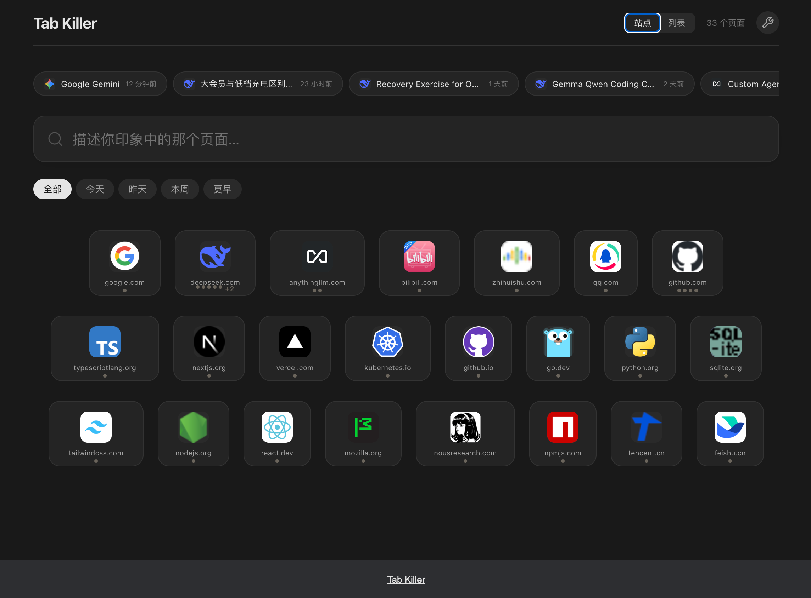
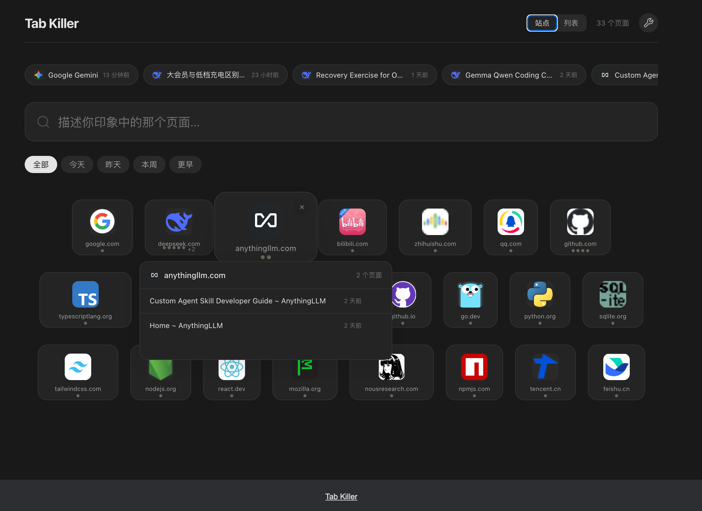
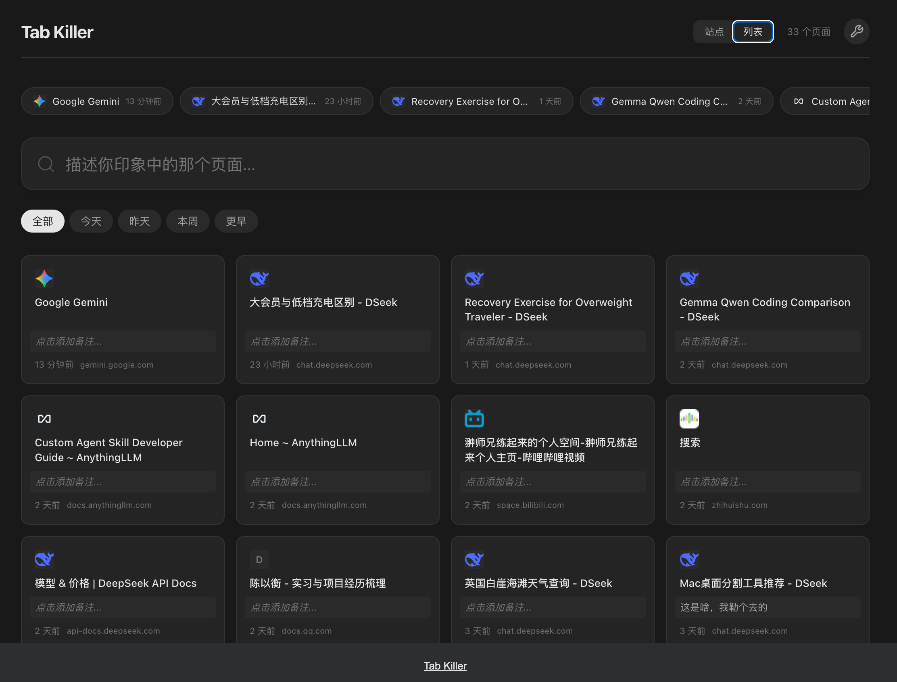
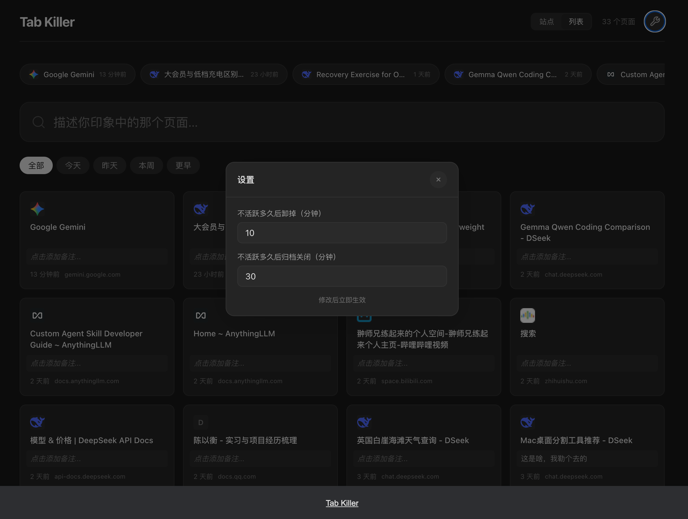

[中文](README.md) · [English](README.en.md)

# Tab Killer

标签页越开越多，浏览器越来越慢，这是所有"多标签党"的日常。**Tab Killer 在后台自动冻结闲置标签页，把内存还给你。**

"那个页面明明打开过，怎么就是找不到？"——只要记得个大概，搜一下就能回来。

不用手动清理，不用分类整理。装好就完事。**标签页不碍眼、不碍事，也不会丢。**

## 功能

### 自动归档
- **不活跃超时** → 自动 discard（冻结内存，标签页保留在标签栏）
- **继续不活跃** → 自动归档（保存页面信息后关闭标签页，展示到新标签页；时间阈值均可调）
- **重复标签页检测** → 每 10 分钟扫描，自动关闭重复 URL（保留最近活跃的那个）

### 新标签页即传送门
- **域名 Tile 画廊** — 按根域名分组，`api.xxx.com` 和 `chat.xxx.com` 自动归到一个 tile 下；tile 宽度随域名长度自适应
- **Hover 展开** — tile 弹簧放大 1.28x，弹出该域名下页面列表面板；底部缓冲区域防误触脱离热区

- **圆点计数** — tile 内图标底部灰点表示页面数量，最多 5 点 + 溢出数字（如 +3），无红点焦虑
- **单页直达** — 域名下仅 1 个页面时，点击 tile 直接恢复打开，无需展开面板
- **视图切换** — 站点模式（tile 画廊）↔ 列表模式（多列卡片网格），一键切换

- **最近横滚条** — 顶部胶囊横滚条展示最近 12 篇归档，快速扫到新鲜内容
- **AI 风格搜索** — 大号输入框，中文分词 + 关键词高亮 + 时间衰减评分，像对话一样搜索
- **时间筛选** — 全部 / 今天 / 昨天 / 本周 / 更早

### 删除管理
- **页面级删除** — 卡片 hover 时右上角 ×，删单条
- **域名级删除** — tile hover 时右上角灰 ×，hover 变红，确认后删整个站点所有归档

### Sidebar（点击工具栏图标）
- **记下目的** — 给当前页面写一句备注，Enter 即保存
- **双向同步** — 新标签页里编辑笔记 ↔ sidebar 打开实时看到
- **快捷入口** — 底部卡片式按钮跳转归档页面，展示 ⌘T 快捷键

### 设计
- **本地优先** — 所有数据存 Chrome Storage Local，不上传任何信息
- **可调阈值** — 点击齿轮图标，自定义 discard / archive 的超时时间

- **暗色模式** — 自动跟随系统
- **Anthropic 风格** — 暖色调、弹性动画、安静克制

## 安装

1. 克隆仓库或下载源码
2. 打开 Chrome，进入 `chrome://extensions/`
3. 开启右上角「开发者模式」
4. 点击「加载已解压的扩展程序」，选择项目目录

## 技术栈

Manifest V3 · Service Worker · Chrome Storage · Vanilla JS · CSS Custom Properties
